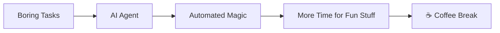

#  Hi there, I'm **Janot**

<div align="center">
  


</div>

---

##  **What I Do**

<table>
<tr>
<td width="50%">

```javascript
const janot = {
  role: "Automation Engineer",
  philosophy: "Why do manually when you can automate?",
  currentStatus: "Making systems talk to each other",
  coffeeLevel: "Optimizing for more ☕",
  sleepMode: "Enabled (while automations run)"
};
```

</td>
<td width="50%">

### 🎯 **Core Expertise**
- ⚙️ **n8n Workflows** - Low-code, high-power automation
- 🧠 **Intelligent Systems** - AI that actually works
- 🛠️ **Backend Engineering** - JSON-fluent APIs
- 🔄 **Process Optimization** - Until the coffee runs out

</td>
</tr>
</table>

---

## 🧬 **Tech DNA**

<div align="center">


</div>

---

## 🧪 **Current Lab Experiments** 

<details>
<summary><b>🤖 AI Agents & Automation</b></summary>
<br>



Building intelligent agents that handle the mundane so I can focus on the exciting challenges!

</details>

<details>
<summary><b>🚀 Serverless Architecture</b></summary>
<br>

- **Node.js** microservices that scale like dreams
- **MongoDB** databases that never sleep
- **Serverless** functions that appear when needed
- Zero-downtime deployments (mostly 😅)

</details>

<details>
<summary><b>🔧 Production-Ready Systems</b></summary>
<br>

> *"It works on my machine"* ➡️ *"It works everywhere"*

Building resilient systems that survive the chaos of real-world usage.

</details>

---

## 📊 **Automation Stats**

<div align="center">


</div>

---

## 💬 **Let's Talk About**

<table>
<tr>
<td>

### 🔄 **Workflow Automation**
*Turning repetitive tasks into elegant flows*

</td>
<td>

### 🏗️ **Backend Architecture** 
*Systems that scale and never break*

</td>
</tr>
<tr>
<td>

### ⚡ **n8n Power User**
*Low-code doesn't mean low-power*

</td>
<td>

### 🍿 **Debug Snacks**
*The fuel of great engineering*

</td>
</tr>
</table>

---

## 🌐 **Connect & Collaborate**

<div align="center">

[](https://www.linkedin.com/in/janot-emmanuel-jia-heng)
[](mailto:emmanueljanot23@gmail.com)
[](https://github.com/YourGitHubUsername)

</div>

---

<div align="center">

### 💡 *"Why do it manually when you can spend 3 hours automating it **in style**?"*


---

**⭐ Star my repos if they make your automation dreams come true!**

</div>

---

<div align="center">
  
</div>
